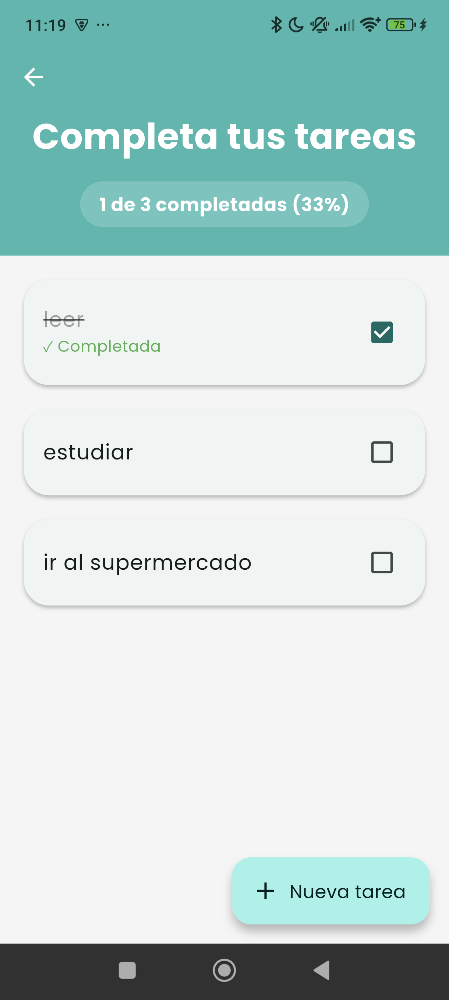
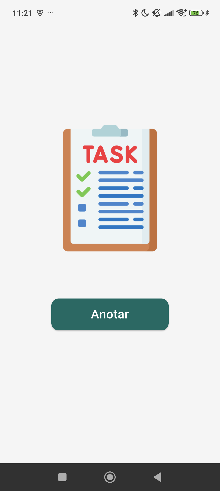

# 📝 To Do App - Flutter

A mobile app developed in Flutter to manage your daily tasks quickly and efficiently. Designed with a clean and intuitive interface to improve your productivity.

---

## ✨ Features

- ➕ **Add Tasks**

Easily create new tasks to keep your day organized.

- ✅ **Mark as Completed**

View your progress by marking tasks you've finished.

- 🗑️ **Delete Tasks**

Get rid of tasks you no longer need or that were created by mistake.

- 💾 **Data Persistence** (Optional/Future)

Save your tasks locally so you don't lose them when you close the app.

- 🎨 **Clean and User-Friendly Design**

Minimalist interface focused on usability.

- 🌍 **Cross-Platform Support**
  Compatible with **Android**, **Windows** and **Web**.

---

## 📸 Screenshots

<p align="center">
  
  
</p>


---

## 🚀 Getting Started

Follow these instructions to get a copy of the project and run it on your local machine.

### Prerequisites

* [Flutter SDK](https://docs.flutter.dev/get-started/install) installed.

* An Android/iOS emulator or a connected physical device.

* A code editor (VS Code, Android Studio, etc.).

### Installation

1. **Clone the repository** :
```bash
git clone https://github.com/CarlosM1024/ToDoApp_Flutter.git
```
2. **Navigate to the project directory**:
```bash
cd ToDoApp_Flutter
```
3. **Install dependencies** :
```bash
flutter pub get
```
4. **Run the main.dart file** :
````bash
flutter run
````
---
## 🛠️ Project Structure

The project is organized to separate logic, UI, and reusable components:
````grapgql 
lib/
├── 📄 main.dart                         # Punto de entrada e inicialización de la aplicación
└── 📂 app/                      
    ├── 📄 app.dart                      # Configuración de la pantalla de la aplicación
    ├── 📂 repository/
    │   └── 📄 task_repository.dart      # Logica de la persistencia de datos
    ├── 📂 model/                        
    │   └── 📄 task.dart                 # Modelo de datos de tareas
    └── 📂 View/                 
        ├── 📂 components/
        │   └── 📄 texto.dart            # Estetica de texto
        ├── 📂 splash/    
        │   └── 📄 splash_page.dart      # Visualización de la pantalla de inicio   
        └── 📂 task_list/
            └── 📄 task_list_page.dart   # Visualización de la lista de tareas
````

---

## 👤 Author

**Carlos Antonio Martinez Miranda**

GitHub: [@CarlosM1024](https://github.com/CarlosM1024)